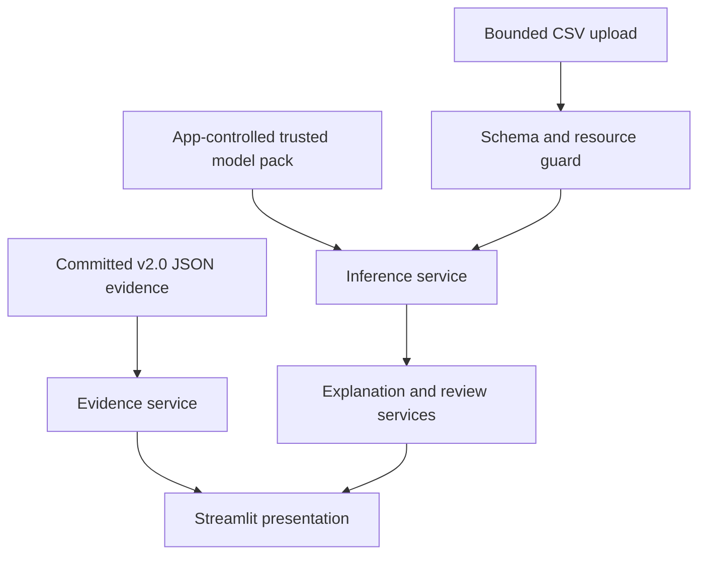

# v2.1 analyst workbench design

Status: **Design complete; Phase 1 implementation in progress**

Design version: `cids-analyst-workbench-v1`

This document defines the v2.1 product boundary, user journeys, data and model
contracts, security controls, implementation phases, and acceptance criteria.
It must be read together with [`PROJECT_PLAN.md`](../PROJECT_PLAN.md) and the
[frozen v2.0 results](v2-official-test-results.md).

## Outcome

v2.1 will be a local, offline **analyst workbench** for two related jobs:

1. Inspect the frozen v2.0 benchmark evidence without downloading the dataset or
   loading a model.
2. Triage a bounded CSV of compatible flow features with explicitly trusted local
   model artifacts, then inspect model scores, disagreements, explanations, and
   label-backed errors when labels are available.

It is not a live intrusion detection system. It will not capture packets, derive
flows from PCAP, inspect current network traffic, block connections, or automate
response. Those capabilities remain outside v2.1.

## Product principles

- Present what the project can prove, including poor results and limitations.
- Keep the frozen v2.0 official-test evidence read-only.
- Make the no-model experience useful to an external reviewer.
- Treat uploaded CSV data and serialized models as separate trust domains.
- Call an uncalibrated probability a **model score**, not confidence or risk.
- Never invent timestamps, hosts, IP addresses, or causal explanations.
- Keep Streamlit as a thin presentation layer over tested Python services.
- Fail closed on incompatible schemas, artifacts, provenance, or environments.

## Users and journeys

| User | Starting point | Successful journey |
|---|---|---|
| Portfolio reviewer | Cloned repository only | Starts evidence mode, understands the two v2.0 tasks, sees held-out performance and limitations, and verifies result provenance. |
| ML/security learner | Repository plus safe sample | Runs a bounded demonstration, examines binary and family predictions, and sees which features influenced a selected record without interpreting them as causes. |
| Project maintainer | Official local dataset and locally created models | Registers or builds a trusted model pack, analyzes compatible flow CSVs, reviews labeled errors, and exports sanitized results. |

## Operating modes

### Evidence mode — default

Evidence mode reads only committed, non-executable files:

- `results/v2.0/official-test-results.json`
- `results/v2.0/run-state.json`
- `results/v2.0/SHA256SUMS`
- frozen v2.0 configuration and schema documents

It must start without the UNSW-NB15 CSV files and without model artifacts. It
shows the official metrics, confusion matrices, validation-to-test change,
per-family performance, provenance hashes, and limitations. It does not produce
new predictions or recompute the official evaluation.

### Trusted local inference — explicit opt-in

Inference mode is disabled unless an app-controlled model-pack directory passes
all preflight checks. The dashboard never accepts a model upload, URL, or arbitrary
model path. A command-line operation outside the web UI must create or register
the pack and record the user's explicit trust decision.

Two provenance types are allowed:

| Type | Purpose | Claim boundary |
|---|---|---|
| `maintainer_final_v2` | Register the maintainer's original local final artifacts from the completed v2.0 run. | May identify the artifact as the frozen v2.0 final model when every frozen hash and metadata value matches. |
| `development_demo_v1` | Rebuild selected models on the frozen cleaned development partition without scoring the official test. | Demonstration model only; its predictions are not the published v2.0 official result. |

The development builder may use the official test feature vectors only through
the already frozen overlap-removal split policy. It must never score, summarize,
or expose official-test targets or predictions.

## System boundary and flow



The presentation layer may call application services, but model loading,
validation, prediction, explanation, metric calculation, and export sanitization
must not be implemented directly in Streamlit page code.

## Proposed repository shape

```text
dashboard/
└── app.py                         # Streamlit entry point and page composition
src/cids/workbench/
├── contracts.py                   # Input, alert, and manifest contracts
├── evidence.py                    # Read-only frozen-result adapter
├── model_pack.py                  # Registration, hashes, and trusted loading
├── inference.py                   # Scores, predictions, and disagreements
├── explanations.py                # Global/local explanation adapter
├── review.py                      # Labeled errors and threshold what-if analysis
└── export.py                      # Safe JSON/CSV export
configs/
└── v2.1-workbench-v1.json         # Resource limits and presentation policy
tests/
├── test_workbench_contracts.py
├── test_workbench_evidence.py
├── test_workbench_model_pack.py
├── test_workbench_inference.py
├── test_workbench_explanations.py
└── test_workbench_export.py
```

## Dashboard information architecture

| Page | Evidence mode | Inference additions |
|---|---|---|
| Overview | Release status, scope, headline metrics, validation-to-test change | Uploaded record and alert counts, model-pack identity |
| Binary detection | Confusion matrix, recall, FPR/FNR, ROC-AUC and PR-AUC | Record-level attack scores, prediction distribution, threshold what-if view when labels exist |
| Attack families | Per-family precision/recall/F1 and confusion matrix | Predicted family distribution and binary/family disagreement queue |
| False-positive review | Frozen aggregate false-positive evidence | Row review only when uploaded binary labels exist |
| Explainability | Method, limitations, and availability state | Global feature reliance and per-record contribution view after the explanation gate passes |
| Provenance | Dataset, schema, config, selection, protocol, result hashes | Artifact hashes, environment match, provenance type, and input digest |

The base UNSW-NB15 prepared schema has no event timestamp and no source or
destination IP address. Therefore:

- the default x-axis is named **record sequence**, never alert timeline;
- a timeline is shown only when a valid optional `event_time` column is supplied;
- host and IP fields are not displayed in v2.1;
- PCAP or live-flow identity remains a v3.0 concern.

## CSV input contract

The inference contract is distinct from the strict 45-column training schema.
It accepts feature-only data and optional analysis metadata.

### Required columns

All 42 fields in `FEATURE_COLUMNS` from
`src/cids/datasets/unsw_nb15.py` are required exactly once. The same categorical,
numeric, null, empty, and finite-value rules used by the frozen schema apply.

### Optional columns

| Column | Rule | Use |
|---|---|---|
| `id` | Non-null and unique; generated as `record-000001` etc. when absent | Stable record selection and export |
| `event_time` | ISO 8601 with an explicit UTC offset; normalized to UTC | Enables a real timeline |
| `label` | Only `0` or `1` | Enables binary error and threshold what-if analysis |
| `attack_cat` | One of the ten canonical families; must agree with `label` when both exist | Enables per-family error analysis |

Unrecognized columns are rejected with their names listed. The UI does not
silently drop columns because that could hide schema drift or accidental
sensitive fields. Non-empty categorical values outside the fitted vocabulary are
accepted because the frozen preprocessor defines that behavior, but the UI must
count and flag them as out-of-vocabulary values before prediction.

### Resource and parsing limits

- One `.csv` file per analysis.
- Maximum uploaded size: 10 MiB.
- Maximum data rows: 50,000.
- UTF-8 text with one header row; malformed quoting or duplicate headers fails.
- Parsing is bounded before full model inference; compressed files are rejected.
- Uploaded bytes remain in memory for the session and are not written to disk or
  logged by the application.
- No external URL, network retrieval, archive extraction, or filename-derived
  filesystem path is allowed.

These limits are versioned policy values, not claims that larger inputs are
safe. Streamlit's extension filter is only a convenience check, so the service
must validate content independently.

## Prediction and alert contract

Every accepted record produces one internal result with these fields:

| Field | Meaning |
|---|---|
| `record_id` | Supplied or generated identifier |
| `event_time_utc` | Normalized timestamp or `null` |
| `binary_prediction` | `normal` or `attack` using the frozen estimator decision rule |
| `attack_model_score` | Uncalibrated `predict_proba` score for the attack class |
| `family_prediction_raw` | Independent ten-class prediction |
| `family_model_score` | Uncalibrated score for `family_prediction_raw` |
| `triage_family` | Raw family when binary predicts attack; `unresolved` when binary says attack but family says normal; otherwise `not_alerted` |
| `queue_band` | `not_alerted`, `review`, `higher_score_review`, or `model_disagreement` |
| `explanation_status` | `available`, `not_requested`, `unsupported`, or `failed` |
| `top_contributions` | Bounded list of feature contribution records when available |
| `model_pack_id` | Digest-backed provenance reference |

`queue_band` organizes a demonstration review queue; it is not threat severity
or business risk. Its initial deterministic rule is:

1. binary normal becomes `not_alerted`;
2. binary attack plus multiclass normal becomes `model_disagreement`;
3. other binary attacks with attack score below `0.90` become `review`;
4. other binary attacks with attack score at least `0.90` become
   `higher_score_review`.

The `0.90` band boundary is a display policy and not an optimized detection
threshold. The binary classification decision remains unchanged.

## Score and threshold policy

The v2.0 classifiers were not evaluated for probability calibration. Their
`predict_proba` values must therefore be labeled **model score (uncalibrated)**,
not confidence. They must never be displayed as a percentage chance that an
event is malicious.

A threshold what-if view is allowed only when the uploaded CSV includes binary
ground truth. It may show how alert count, precision, recall, F1, FPR, and FNR
change on that uploaded sample. It must:

- begin at the frozen decision threshold;
- be labeled an ephemeral sample-specific simulation;
- never update the model, configuration, evidence files, or default threshold;
- never operate on the v2.0 official-test partition;
- avoid language such as "optimal threshold."

Without ground-truth labels, records may be called alerts or predictions, but
not true positives, false positives, false negatives, or measured detections.

## Explainability contract and gate

SHAP is a proposed implementation, not yet an approved dependency. Before UI
implementation, a pinned Python 3.12 technical spike must demonstrate all of the
following for both selected Histogram Gradient Boosting models:

1. The explainer supports the fitted estimator and transformed dense features.
2. Returned class dimensions map correctly to estimator class labels.
3. Additivity or conservation checks pass within a documented tolerance.
4. Binary and multiclass per-record explanations complete within bounded time
   and memory for the configured sample limits.
5. One-hot contributions can be deterministically aggregated back to the 42
   source features.
6. Background data is a deterministic, stratified sample of the cleaned
   development partition only—never the official test.

If any gate fails, v2.1 must not display a substitute as if it were SHAP. A new
decision record must either approve a bounded model-agnostic local explainer or
limit v2.1 to global permutation importance calculated on development data.
Permutation importance is global model reliance, not a per-record explanation.

When available, each contribution record contains the source feature, observed
value, signed contribution, explained class, baseline output, and model output.
The UI says "influenced this model output," never "caused this attack." Global
views state the dataset and scoring metric on which importance was computed.

## False-positive review

Evidence mode can show only aggregate frozen errors because the repository does
not contain the official raw records. In inference mode:

- binary false positives are available only when `label` exists;
- per-family misclassifications are available only when `attack_cat` exists;
- filters include actual label, predicted label, queue band, score range, and
  disagreement state;
- selecting a row shows its raw feature values and explanation, not fabricated
  network identity;
- threshold simulation is isolated from the review table and never persisted.

## Trusted model-pack contract

The proposed manifest version is `cids-trusted-model-pack-v1`. It records:

- a generated `model_pack_id`;
- provenance type and explicit trust acknowledgement;
- binary and multiclass artifact filenames and SHA-256 values;
- artifact, schema, preprocessing, experiment, selection, and protocol versions;
- Python and library versions;
- training scope and creation timestamp;
- the digest of the command/configuration that built or registered the pack.

Before calling `joblib.load`, preflight must verify the manifest schema, explicit
trust acknowledgement, expected task set, file names, regular-file status,
containment inside the configured pack directory, artifact hashes, frozen
manifest values, and exact runtime versions. After deserialization, the normal
artifact validators must verify object type and fitted state and compare all
internal metadata with the manifest and frozen contracts.

This verification detects mistakes and tampering after local registration. It
does not make an untrusted pickle safe: an attacker could replace both a model
and its manifest. The trust anchor is the user's explicit CLI action and the
app-controlled local directory. The web UI will not create that trust decision.
Investigating `skops.io` or ONNX may be a later hardening study, but changing the
artifact format is not required for the first v2.1 implementation.

## Threat model

| Threat | Control | Residual limitation |
|---|---|---|
| Malicious serialized model executes code | No model upload or URL; explicit CLI trust; app-controlled directory; pre-load hash/provenance checks | A user can still explicitly trust a malicious local artifact |
| Oversized or adversarial CSV exhausts resources | 10 MiB/50,000-row limits, bounded parsing and explanations, no archives | Crafted in-limit data can still consume CPU |
| Filename/path traversal | Ignore uploaded name as a path; never persist upload; contain model paths under configured root | Host filesystem permissions still matter |
| Schema confusion or hidden sensitive columns | Exact allowlist, duplicate-header detection, reject unknown fields | Feature values themselves may still be sensitive |
| Spreadsheet formula execution after CSV export | Prefix cells beginning with `=`, `+`, `-`, `@`, tab, or carriage return; offer JSON as safer default | Downstream tools may transform exports |
| Cross-session data exposure | Session-scoped data; no raw-data cache; clear state on replacement | Process memory persists until released by runtime |
| Accidental network exposure | Localhost-first command; no authentication claim; Docker publishes to `127.0.0.1` by default | Users can deliberately expose the port |
| Misleading security conclusion | Persistent research-only banner, score/calibration labels, visible frozen limitations | Reviewers may still ignore documentation |

No telemetry, remote model API, cloud storage, secrets, or user accounts are
needed. If remote/multi-user deployment is later requested, it requires a new
security design with authentication, authorization, transport security,
retention, concurrency, and audit controls.

## Implementation phases

### Phase 1 — Contracts and technical gates

- Implement feature-only input validation and bounded parsing.
- Implement frozen evidence loading with schema and hash checks.
- Define alert and trusted-model-pack dataclasses/schemas.
- Run and document the SHAP compatibility, correctness, and performance spike.
- Add unit tests for every fail-closed path.

Exit: services pass tests without importing Streamlit; the explanation approach
has an explicit go/no-go decision.

Implementation status: the contracts, evidence loader, model-pack preflight, and
representative explanation tests are complete. The go/no-go decision remains
open until the [selected-artifact SHAP gate](shap-compatibility-gate.md) runs on
the original local final models.

### Phase 2 — Evidence-first dashboard

- Add the Overview, Binary detection, Attack families, and Provenance pages.
- Make evidence mode work with no dataset or local model.
- Add charts with accessible labels and exact-value tables.
- Add the persistent research-only and limitation notices.

Exit: a clean clone can run and explain v2.0 without model artifacts.

### Phase 3 — Trusted inference and review

- Add CLI model-pack build/registration and preflight.
- Add bounded feature CSV upload and independent binary/multiclass scoring.
- Add record-sequence/timestamp views, disagreements, label-backed errors, and
  ephemeral threshold simulation.
- Add sanitized JSON and CSV export.

Exit: no prediction path can load a web-uploaded model or bypass the input and
artifact contracts.

### Phase 4 — Explainability and safe demonstration

- Implement the approved global and local explanation method.
- Aggregate transformed features to the original 42-feature vocabulary.
- Add a small synthetic contract-valid sample that is clearly labeled as
  non-realistic and not benchmark evidence.
- Add explanation performance limits and failure isolation.

Exit: a reviewer can inspect a prediction and understand model influence without
being told that an explanation proves causality.

### Phase 5 — Packaging and release

- Add a pinned dashboard dependency set separate from the v2.0 reproduction lock.
- Add a non-root Docker image and health check.
- Default local execution to loopback; publish Docker port on loopback in docs.
- Mount trusted artifacts read-only and keep transient storage ephemeral.
- Add Streamlit smoke tests, container checks, documentation, and release notes.

Exit: all acceptance criteria below pass on a clean Python 3.12 environment and
in the documented container workflow.

## Release acceptance criteria

- [ ] Evidence mode starts from a clean clone with no dataset or model.
- [ ] Every displayed frozen number is derived from the committed v2.0 JSON and
      its checksums are verified.
- [ ] The official test is never rerun, rescored, or used for threshold tuning.
- [ ] The upload contract accepts exactly the 42 features plus documented
      optional metadata and rejects all invalid cases clearly.
- [ ] Upload size, row count, parsing, and explanation work are bounded.
- [ ] No browser action can select, upload, download, or trust a model artifact.
- [ ] Model-pack preflight happens before deserialization and rejects any mismatch.
- [ ] Deserialized artifact type and internal metadata match the verified manifest.
- [ ] Scores are labeled uncalibrated and are not described as risk or confidence.
- [ ] False-positive language appears only when ground truth exists.
- [ ] Record sequence is not called a timeline unless `event_time` exists.
- [ ] No IP address, hostname, or causal claim is fabricated.
- [ ] Explanations pass the documented gate and map back to source features.
- [ ] JSON/CSV exports contain provenance and neutralize spreadsheet formulas.
- [ ] Safe sample data is synthetic, non-sensitive, and labeled non-realistic.
- [ ] Unit, integration, Streamlit smoke, and Docker tests pass.
- [ ] The README and project state describe exact setup and remaining limitations.

## Explicitly out of scope

- Live packet capture, PCAP parsing, or flow extraction.
- Streaming ingestion or a real-time alert timeline.
- Source/destination identity absent from the model input contract.
- Automated blocking, ticketing, escalation, or incident response.
- Production SOC deployment, multi-user hosting, or authentication.
- Retraining, calibrating, or tuning v2.0 against its official-test results.
- Treating analyst feedback as labels or model updates.

## Technical references

- [Streamlit file uploader](https://docs.streamlit.io/develop/api-reference/widgets/st.file_uploader): extension checks are best effort, uploaded names are not sanitized paths, and upload size can be bounded per widget.
- [Streamlit resource caching](https://docs.streamlit.io/develop/api-reference/caching-and-state/st.cache_resource): global cached resources are shared across sessions and must be thread-safe; v2.1 will avoid caching raw uploaded data.
- [scikit-learn model persistence](https://scikit-learn.org/stable/model_persistence.html): joblib is pickle-based, can execute arbitrary code on load, and requires a compatible environment.
- [scikit-learn probability calibration](https://scikit-learn.org/stable/modules/calibration.html): probability outputs are interpretable as confidence only when calibration has been established.
- [scikit-learn permutation importance](https://scikit-learn.org/stable/modules/permutation_importance.html): a model-agnostic global reliance method whose meaning depends on model quality, data, and metric.
- [SHAP TreeExplainer](https://shap.readthedocs.io/en/stable/generated/shap.TreeExplainer.html): documents tree-model explanations and background-data semantics; exact compatibility with this project's selected estimators remains gated by a pinned spike.
