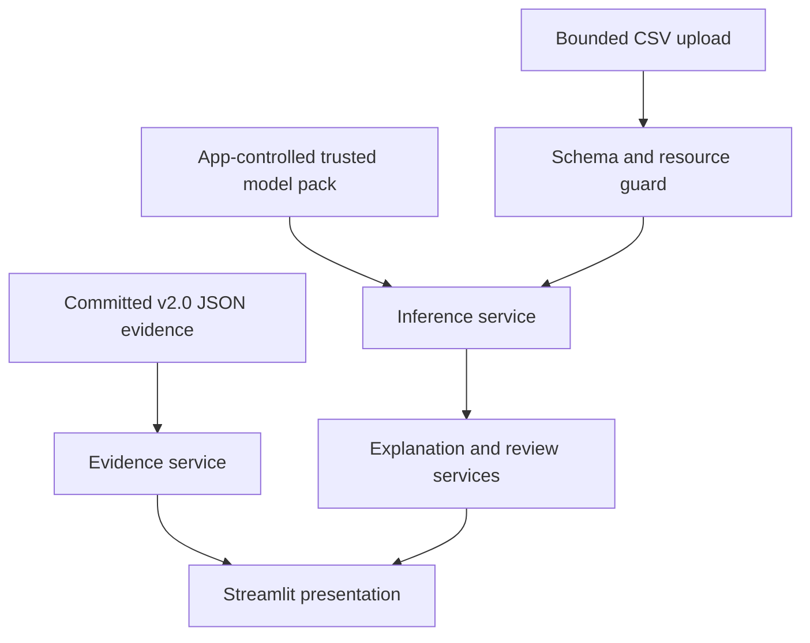

# v2.1 analyst workbench design

Status: **Design complete; Phases 1–4 merged; Phase 5 implemented and awaiting independent review; v2.1 unpublished**

Design version: `cids-analyst-workbench-v1`

This document defines the v2.1 product boundary, user journeys, data and model
contracts, security controls, implementation phases, and acceptance criteria.
It must be read together with [`PROJECT_PLAN.md`](../PROJECT_PLAN.md) and the
[frozen v2.0 results](v2-official-test-results.md).

## Outcome

v2.1 will be a local, offline **analyst workbench** for two related jobs:

1. Inspect the frozen v2.0 benchmark evidence without downloading the dataset or
   loading a model.
2. Triage a bounded CSV of compatible flow features with explicitly trusted local
   model artifacts, then inspect model scores, disagreements, explanations, and
   label-backed errors when labels are available.

It is not a live intrusion detection system. It will not capture packets, derive
flows from PCAP, inspect current network traffic, block connections, or automate
response. Those capabilities remain outside v2.1.

## Product principles

- Present what the project can prove, including poor results and limitations.
- Keep the frozen v2.0 official-test evidence read-only.
- Make the no-model experience useful to an external reviewer.
- Treat uploaded CSV data and serialized models as separate trust domains.
- Call an uncalibrated probability a **model score**, not confidence or risk.
- Never invent timestamps, hosts, IP addresses, or causal explanations.
- Keep Streamlit as a thin presentation layer over tested Python services.
- Fail closed on incompatible schemas, artifacts, provenance, or environments.

## Users and journeys

| User | Starting point | Successful journey |
|---|---|---|
| Portfolio reviewer | Cloned repository only | Starts evidence mode, understands the two v2.0 tasks, sees held-out performance and limitations, and verifies result provenance. |
| ML/security learner | Repository plus safe sample | Runs a bounded demonstration, examines binary and family predictions, and sees which features influenced a selected record without interpreting them as causes. |
| Project maintainer | Official local dataset and locally created models | Registers or builds a trusted model pack, analyzes compatible flow CSVs, reviews labeled errors, and exports sanitized results. |

## Operating modes

### Evidence mode — default

Evidence mode reads only committed, non-executable files:

- `results/v2.0/official-test-results.json`
- `results/v2.0/run-state.json`
- `results/v2.0/SHA256SUMS`
- frozen v2.0 configuration and schema documents

It must start without the UNSW-NB15 CSV files and without model artifacts. It
shows the official metrics, confusion matrices, validation-to-test change,
per-family performance, provenance hashes, and limitations. It does not produce
new predictions or recompute the official evaluation.

### Trusted local inference — explicit opt-in

Inference mode is disabled unless an app-controlled model-pack directory passes
all preflight checks. The dashboard never accepts a model upload, URL, or arbitrary
model path. A command-line operation outside the web UI must create or register
the pack and record the user's explicit trust decision.

Two provenance types are allowed:

| Type | Purpose | Claim boundary |
|---|---|---|
| `maintainer_final_v2` | Register the maintainer's original local final artifacts from the completed v2.0 run. | May identify the artifact as the frozen v2.0 final model when every frozen hash and metadata value matches. |
| `development_demo_v1` | Rebuild selected models on the frozen cleaned development partition without scoring the official test. | Demonstration model only; its predictions are not the published v2.0 official result. |

The development builder may use the official test feature vectors only through
the already frozen overlap-removal split policy. It must never score, summarize,
or expose official-test targets or predictions.

## System boundary and flow


```mermaid
flowchart TD
    A["Committed v2.0 JSON evidence"] --> B["Evidence service"]
    C["App-controlled trusted model pack"] --> D["Inference service"]
    E["Bounded CSV upload"] --> F["Schema and resource guard"]
    F --> D
    B --> G["Streamlit presentation"]
    D --> H["Explanation and review services"]
    H --> G
```

The presentation layer may call application services, but model loading,
validation, prediction, explanation, metric calculation, and export sanitization
must not be implemented directly in Streamlit page code.

## Proposed repository shape

```text
dashboard/
└── app.py                         # Streamlit entry point and page composition
src/cids/workbench/
├── contracts.py                   # Input, alert, and manifest contracts
├── evidence.py                    # Read-only frozen-result adapter
├── model_pack.py                  # Manifest contract and pre-load preflight
├── registration.py                # CLI-only trusted-pack registration (3A)
├── inference.py                   # Scores, predictions, and disagreements
├── explanations.py                # Global/local explanation adapter
├── review.py                      # Labeled errors and threshold what-if analysis
└── export.py                      # Safe JSON/CSV export
configs/
├── v2.1-model-pack-registration-v1.json  # Frozen registration policy (3A)
├── v2.1-workbench-v1.json         # Rejected TreeExplainer proposal
└── v2.1-workbench-v2.json         # Active resource and explanation policy
tests/
├── test_workbench_contracts.py
├── test_workbench_evidence.py
├── test_workbench_model_pack.py
├── test_workbench_inference.py
├── test_workbench_explanations.py
└── test_workbench_export.py
```

## Dashboard information architecture

| Page | Evidence mode | Inference additions |
|---|---|---|
| Overview | Release status, scope, headline metrics, validation-to-test change | Uploaded record and alert counts, model-pack identity |
| Binary detection | Confusion matrix, recall, FPR/FNR, ROC-AUC and PR-AUC | Record-level attack scores, prediction distribution, threshold what-if view when labels exist |
| Attack families | Per-family precision/recall/F1 and confusion matrix | Predicted family distribution and binary/family disagreement queue |
| False-positive review | Frozen aggregate false-positive evidence | Row review only when uploaded binary labels exist |
| Explainability | Method, limitations, and availability state | Global feature reliance and per-record contribution view after the explanation gate passes |
| Provenance | Dataset, schema, config, selection, protocol, result hashes | Artifact hashes, environment match, provenance type, and input digest |

The base UNSW-NB15 prepared schema has no event timestamp and no source or
destination IP address. Therefore:

- the default x-axis is named **record sequence**, never alert timeline;
- a timeline is shown only when a valid optional `event_time` column is supplied;
- host and IP fields are not displayed in v2.1;
- PCAP or live-flow identity remains a v3.0 concern.

## CSV input contract

The inference contract is distinct from the strict 45-column training schema.
It accepts feature-only data and optional analysis metadata.

### Required columns

All 42 fields in `FEATURE_COLUMNS` from
`src/cids/datasets/unsw_nb15.py` are required exactly once. The same categorical,
numeric, null, empty, and finite-value rules used by the frozen schema apply.

### Optional columns

| Column | Rule | Use |
|---|---|---|
| `id` | Non-null and unique; generated as `record-000001` etc. when absent | Stable record selection and export |
| `event_time` | ISO 8601 with an explicit UTC offset; normalized to UTC | Enables a real timeline |
| `label` | Only `0` or `1` | Enables binary error and threshold what-if analysis |
| `attack_cat` | One of the ten canonical families; must agree with `label` when both exist | Enables per-family error analysis |

Unrecognized columns are rejected with their names listed. The UI does not
silently drop columns because that could hide schema drift or accidental
sensitive fields. Non-empty categorical values outside the fitted vocabulary are
accepted because the frozen preprocessor defines that behavior, but the UI must
count and flag them as out-of-vocabulary values before prediction.

### Resource and parsing limits

- One `.csv` file per analysis.
- Maximum uploaded size: 10 MiB.
- Maximum data rows: 50,000.
- UTF-8 text with one header row; malformed quoting or duplicate headers fails.
- Parsing is bounded before full model inference; compressed files are rejected.
- Uploaded bytes remain in memory for the session and are not written to disk or
  logged by the application.
- No external URL, network retrieval, archive extraction, or filename-derived
  filesystem path is allowed.

These limits are versioned policy values, not claims that larger inputs are
safe. Streamlit's extension filter is only a convenience check, so the service
must validate content independently.

## Prediction and alert contract

Every accepted record produces one internal result with these fields:

| Field | Meaning |
|---|---|
| `record_id` | Supplied or generated identifier |
| `event_time_utc` | Normalized timestamp or `null` |
| `binary_prediction` | `normal` or `attack` using the frozen estimator decision rule |
| `attack_model_score` | Uncalibrated `predict_proba` score for the attack class |
| `family_prediction_raw` | Independent ten-class prediction |
| `family_model_score` | Uncalibrated score for `family_prediction_raw` |
| `triage_family` | Raw family when binary predicts attack; `unresolved` when binary says attack but family says normal; otherwise `not_alerted` |
| `queue_band` | `not_alerted`, `review`, `higher_score_review`, or `model_disagreement` |
| `explanation_status` | `available`, `not_requested`, `unsupported`, or `failed` |
| `top_contributions` | Bounded list of feature contribution records when available |
| `model_pack_id` | Digest-backed provenance reference |

`queue_band` organizes a demonstration review queue; it is not threat severity
or business risk. Its initial deterministic rule is:

1. binary normal becomes `not_alerted`;
2. binary attack plus multiclass normal becomes `model_disagreement`;
3. other binary attacks with attack score below `0.90` become `review`;
4. other binary attacks with attack score at least `0.90` become
   `higher_score_review`.

The `0.90` band boundary is a display policy and not an optimized detection
threshold. The binary classification decision remains unchanged.

## Score and threshold policy

The v2.0 classifiers were not evaluated for probability calibration. Their
`predict_proba` values must therefore be labeled **model score (uncalibrated)**,
not confidence. They must never be displayed as a percentage chance that an
event is malicious.

A threshold what-if view is allowed only when the uploaded CSV includes binary
ground truth. It may show how alert count, precision, recall, F1, FPR, and FNR
change on that uploaded sample. It must:

- begin at the frozen decision threshold;
- be labeled an ephemeral sample-specific simulation;
- never update the model, configuration, evidence files, or default threshold;
- never operate on the v2.0 official-test partition;
- avoid language such as "optimal threshold."

Without ground-truth labels, records may be called alerts or predictions, but
not true positives, false positives, false negatives, or measured detections.

## Explainability contract and gate

SHAP's model-agnostic `PermutationExplainer` is approved by accepted
[ADR 0003](decisions/0003-v2.1-explanation-fallback.md) after the original
TreeExplainer route failed selected-artifact additivity. The pinned Python 3.12
technical spike demonstrated all of the following for both selected Histogram
Gradient Boosting models before UI implementation:

1. The explainer supports the fitted estimator and transformed dense features.
2. Returned class dimensions map correctly to estimator class labels.
3. Additivity or conservation checks pass within a documented tolerance.
4. Binary and multiclass per-record explanations complete within bounded time
   and memory for the configured sample limits.
5. One-hot contributions can be deterministically aggregated back to the 42
   source features.
6. Background data is a deterministic, stratified sample of the cleaned
   development partition only—never the official test.

If the fallback gate fails, v2.1 must limit explainability to global permutation
importance calculated on development data. Permutation importance is global
model reliance, not a per-record explanation.

When available, each contribution record contains the source feature, observed
value, signed contribution, explained class, baseline output, and model output.
The UI says "influenced this model output," never "caused this attack." Global
views state the dataset and scoring metric on which importance was computed.

## False-positive review

Evidence mode can show only aggregate frozen errors because the repository does
not contain the official raw records. In inference mode:

- binary false positives are available only when `label` exists;
- per-family misclassifications are available only when `attack_cat` exists;
- filters include actual label, predicted label, queue band, score range, and
  disagreement state;
- selecting a row shows its raw feature values and explanation, not fabricated
  network identity;
- threshold simulation is isolated from the review table and never persisted.

## Trusted model-pack contract

The proposed manifest version is `cids-trusted-model-pack-v1`. It records:

- a generated `model_pack_id`;
- provenance type and explicit trust acknowledgement;
- binary and multiclass artifact filenames and SHA-256 values;
- artifact, schema, preprocessing, experiment, selection, and protocol versions;
- Python and library versions;
- training scope and creation timestamp;
- the digest of the command/configuration that built or registered the pack.

Before calling `joblib.load`, preflight must verify the manifest schema, explicit
trust acknowledgement, expected task set, file names, regular-file status,
containment inside the configured pack directory, artifact hashes, frozen
manifest values, and exact runtime versions. After deserialization, the normal
artifact validators must verify object type and fitted state and compare all
internal metadata with the manifest and frozen contracts.

This verification detects mistakes and tampering after local registration. It
does not make an untrusted pickle safe: an attacker could replace both a model
and its manifest. The trust anchor is the user's explicit CLI action and the
app-controlled local directory. The web UI will not create that trust decision.
Investigating `skops.io` or ONNX may be a later hardening study, but changing the
artifact format is not required for the first v2.1 implementation.

Phase 3A implements registration for `maintainer_final_v2` without changing the
v1 manifest schema; see [`model-pack-registration.md`](model-pack-registration.md).
The trust anchor is the selected-artifact digests recorded by the accepted,
checksum-verified explanation gate. `creation_config_sha256` is the pinned
canonical digest of
[`configs/v2.1-model-pack-registration-v1.json`](../configs/v2.1-model-pack-registration-v1.json).
Preflight now also requires the pack directory to be named by its
`model_pack_id`, fixed app-owned artifact filenames, UTC timestamps, a 256 MiB
artifact limit and, for `maintainer_final_v2`, agreement with the gate anchor
and the pinned policy digest. No pack had been created under the earlier,
looser checks, so this tightening invalidates nothing.

## Threat model

| Threat | Control | Residual limitation |
|---|---|---|
| Malicious serialized model executes code | No model upload or URL; explicit CLI trust; app-controlled directory; pre-load hash/provenance checks | A user can still explicitly trust a malicious local artifact |
| Oversized or adversarial CSV exhausts resources | 10 MiB/50,000-row limits, bounded parsing and explanations, no archives | Crafted in-limit data can still consume CPU |
| Filename/path traversal | Ignore uploaded name as a path; never persist upload; contain model paths under configured root | Host filesystem permissions still matter |
| Schema confusion or hidden sensitive columns | Exact allowlist, duplicate-header detection, reject unknown fields | Feature values themselves may still be sensitive |
| Spreadsheet formula execution after CSV export | Prefix cells beginning with `=`, `+`, `-`, `@`, tab, or carriage return; offer JSON as safer default | Downstream tools may transform exports |
| Cross-session data exposure | Session-scoped data; no raw-data cache; clear state on replacement | Process memory persists until released by runtime |
| Accidental network exposure | Localhost-first command; no authentication claim; Docker publishes to `127.0.0.1` by default | Users can deliberately expose the port |
| Misleading security conclusion | Persistent research-only banner, score/calibration labels, visible frozen limitations | Reviewers may still ignore documentation |

No telemetry, remote model API, cloud storage, secrets, or user accounts are
needed. If remote/multi-user deployment is later requested, it requires a new
security design with authentication, authorization, transport security,
retention, concurrency, and audit controls.

## Implementation phases

### Phase 1 — Contracts and technical gates

- Implement feature-only input validation and bounded parsing.
- Implement frozen evidence loading with schema and hash checks.
- Define alert and trusted-model-pack dataclasses/schemas.
- Run and document the SHAP compatibility, correctness, and performance spike.
- Add unit tests for every fail-closed path.

Exit: services pass tests without importing Streamlit; the explanation approach
has an explicit go/no-go decision.

Implementation status: **complete**. The contracts, evidence loader, model-pack
preflight, representative tests, and
[selected-artifact SHAP gate](shap-compatibility-gate.md) passed. ADR 0003 is
accepted, so Phase 2 may use the bounded explanation contract where applicable.

### Phase 2 — Evidence-first dashboard

- Add the Overview, Binary detection, Attack families, and Provenance pages.
- Make evidence mode work with no dataset or local model.
- Add charts with accessible labels and exact-value tables.
- Add the persistent research-only and limitation notices.

Exit: a clean clone can run and explain v2.0 without model artifacts.

Implementation status: **complete in evidence mode**. See
[`dashboard.md`](dashboard.md). The Overview, Binary detection, Attack families,
Explainability-status and Provenance pages run from a clean clone without a
dataset or model. Page code lives in `src/cids/dashboard/` with
`dashboard/app.py` as the entry point. The Explainability page shows gate
status and limitations only, because the committed gate report contains no
attributions. `AppTest` smoke tests were added early; container checks remain
Phase 5.

### Phase 3 — Trusted inference and review

Phase 3 is delivered in four sub-phases, each verified before the next starts.

Exit: no prediction path can load a web-uploaded model or bypass the input and
artifact contracts.

#### Phase 3A — Trusted final-model-pack registration and preflight

- Add CLI-only registration of the maintainer's v2.0 final artifacts, anchored
  to the accepted gate evidence, with atomic pack creation.
- Harden the existing preflight and keep registration free of deserialization.

Implementation status: **complete**. See
[`model-pack-registration.md`](model-pack-registration.md). There is no
inference, upload, or dashboard change.

#### Phase 3B — Verified deserialization and framework-independent inference

- Load only a preflighted pack, then validate object type, fitted state, and
  internal metadata against the manifest and frozen contracts.
- Add independent binary/multiclass scoring behind the Phase 1 contracts,
  outside Streamlit.

Implementation status: **complete**. `cids.workbench.inference.load_model_pack()`
calls Phase 3A preflight, accepts only the gate-anchored `maintainer_final_v2`
pack, reads each artifact into at most 256 MiB of memory, compares byte count
and SHA-256 to the preflighted manifest, and calls `joblib.load()` on that same
byte buffer. The post-preflight open is non-following and nonblocking; descriptor
checks require a regular file and stable device, inode, and size. The frozen
experiment configuration's canonical digest is checked before deserialization
and that same configuration validates both tasks. It returns a pack only after
both exact `FinalModelArtifact` objects pass fitted-state, class-order,
estimator, preprocessor, runtime, and
frozen metadata checks. A digest establishes byte identity, not pickle safety;
deserialization executes trusted code. No browser-uploaded or arbitrary model
is accepted.

`infer()` revalidates an `InferenceInput`, scores the two models independently
in deterministic batches of at most 1,024 rows, maps `predict_proba` columns
through `classes_`, rejects malformed scores, and emits `PredictionRecord`
objects with stable IDs, normalized supplied timestamps, queue bands, pack ID,
and no explanation. Scores remain **model scores (uncalibrated)**, never
production risk. The ignored real pack passed a bounded 16-row integration on
a training CSV whose size and SHA-256 match the committed training manifest;
no official-test data or metrics were accessed. Phase 3C adds the separate
opt-in dashboard page described below.

#### Phase 3C — Bounded CSV analysis UI and review queue

- Add bounded feature CSV upload in the dashboard.
- Add record-sequence/timestamp views, queue bands, and disagreements.

Implementation status: **merged by PR #4 at `9d81a3c4136f7062aca3c238c0d041e722dd1330`**.
All four post-merge jobs passed in [CI run 37180576999](https://github.com/arunachaleswaranms/Cyber-Intrusion-Detection-System/actions/runs/37180576999).
Review found no blocking findings; independent tests were **391 passed / 3 skipped**,
the dependency check passed, and all four GitHub CI jobs passed on that commit.
The independent reviewer could not repeat original-model integration checks
requiring ignored local artifacts. The implementer's local verification is
recorded separately in [dashboard operations and verification](dashboard.md);
new-page browser visual QA was outstanding at that handoff; Phase 5 acceptance
records current checks. The separate
**Local CSV analysis** page uses a CLI-only `CIDS_MODEL_PACK_ID` binding under
`artifacts/v2.1/model-packs/`; evidence stays the default. No browser control can
choose, upload, locate or trust a model. Preflight reports availability without
loading. Each explicit **Analyze CSV** action reuses the hardened Phase 3B
loader and inference; display reruns reuse only the completed session result.

The upload read is capped before parsing, and the Phase 1 parser now strictly
checks body quoting/field counts and preserves text IDs. Each model's unknown
categorical row counts are displayed before scoring with the existing ignore
contract unchanged. Digest/pack-bound session state clears on replacement,
removal, configuration changes, failed validation/analysis and explicit clear;
clear also resets the uploader. No global model or raw-data cache is used.
Built-in table CSV/copy export is disabled; the page clears results and refuses
to render analysis data if that setting is off.

The queue shows both independent outputs, uncalibrated scores and the frozen
bands, with a separate disagreement indicator for either direction. Filters
and stable sequence/score/UTC ordering retain original row identity. Tables are
paged at 200 records, with one selected record's 42 features and bounded strings.
Without supplied time the view is Record sequence. Phase 3C validated labels
only; Phase 3D adds review below. The original analysis snapshot's
`explanation_status` remains `not_requested`; Phase 4 task-specific states are
separate. Phase 5 follows the completed Phase 4 merge.
See [dashboard operations and verification](dashboard.md).

#### Phase 3D — Label-backed review, threshold simulation, and safe export

Implementation status: **merged through PR #5** at
`5305f0a317164c24e81631abbc2a870498e0ac7f`; all four post-merge CI jobs passed
in [run 37183225010](https://github.com/arunachaleswaranms/Cyber-Intrusion-Detection-System/actions/runs/37183225010).

`review.py`, `export.py` and `AnalysisSession` own calculations, sanitization
and lifecycle independently of Streamlit. Binary truth requires uploaded
`label`; family truth independently requires `attack_cat` and compares against
`family_prediction_raw`. Missing truth stays absent, including family-only
uploads: no derived binary truth or threshold control. Counts, binary confusion
matrix and precision/recall/F1/FPR/FNR are labeled uploaded-sample results,
separate from benchmark evidence; every rate carries numerator, denominator,
definition and unavailable reason. Defined zero remains zero; undefined is null.
Review supports actual/predicted labels, binary/family categories, bands,
score range and disagreements; stable original indices survive filtering,
sorting, 200-row pagination and bounded selected-record detail.

**Ephemeral, sample-specific threshold simulation** runs only with `label`,
on already-computed scores from the full current uploaded sample, regardless
of review filters. Inspected pinned scikit-learn 1.8.0 HGB `predict()` uses raw
logit `> 0`, with classes `(0, 1)` and normal on exact ties. The sigmoid score
boundary is 0.50; simulation uses `attack_model_score > threshold`, equality
normal. Rounding of stored sigmoid scores near 0.50 can differ from raw-logit
predictions; original records remain authoritative. The 0.90 queue band is
unchanged. Reset restores 0.50; no inference, fitted-model, configuration or
evidence mutation occurs. No optimal-threshold recommendation or calibration.
Official-test rows are never read or scored by this work. Arbitrary uploaded
feature rows cannot establish dataset provenance; the UI explicitly warns
against official-test uploads and benchmark-driven threshold selection.

Exports require **Prepare export**, then a dedicated download. JSON is default;
CSV neutralizes all string cells with formula initiators, including behind
Unicode whitespace/control characters, and preserves genuinely numeric fields.
The schema, allowlist and CSV representation are documented in
[dashboard operations](dashboard.md#explicit-jsoncsv-export-contract).
Full analysis uses original row order; current filtered review includes every
matching page in review order. Original binary results/review are distinct
from optional simulated decisions, whose threshold, strict comparison and full
sample scope are explicit. All bytes and state are session-owned and cleared
with the analysis lifecycle; changing export context discards stale downloads.
No raw features, artifact contents, filesystem paths or unrelated session
state are exported. No application logging, disk writes or global data cache.
Clearing references is not secure memory erasure. Explanations stay
`not_requested`; verification is recorded in dashboard.md.

### Phase 4 — Explainability and safe demonstration

Status: **merged through PR #6 at `ce7f37e`**. Independent review: 588 passed /
4 skipped, dependency check passed, no blocking findings. Four post-merge jobs
passed in run `37191000174`. Original-resource integration and populated browser
views were outstanding at handoff; Phase 5 acceptance tracks their closure.
Detailed setup, contracts and limitations: [explanation-resources.md](explanation-resources.md).

- Shared accepted permutation calculation and source mapping; no historical gate
  rerun or TreeExplainer route. Raw binary attack output always explained, including
  normal predictions; raw multiclass predicted family mapped through `classes_`.
- CLI-only deterministic, task-specific prepared-training backgrounds (≤256),
  feature-only private CSVs and a versioned hash/pack/artifact/schema/policy/runtime/
  frozen-split provenance manifest. Prefer verified prepared partitions matched to
  the checksum-verified training source; only an explicitly permitted feature-only
  official-test overlap reference can reconstruct absent partitions. Test IDs/targets
  are not parsed; test rows never reach estimators or explanations.
- One selected record per explicit dashboard action, separate binary/family state;
  32-record service ceiling, seed 42, one forward/reverse cycle, 60-second deadline.
  Fresh macOS-compatible Python subprocess workers, bounded JSON IPC, watchdog cancellation and cleanup.
- Full class shapes/finiteness/prediction mapping, independent `1e-5` reconstruction
  and `1e-10` conservation before display. All 42 original contributions plus
  baseline/output/class and bounded observed values; explicitly zero omitted sum.
  Raw decision units remain separate from uncalibrated probability-model scores.
- Input/pack/resource/background/policy/task/class/record bindings. Selection and
  lifecycle changes clear stale values; missing resources are unsupported and worker/
  timeout/correctness errors failed, preserving analysis/review/simulation/export.
  Models/data/explanations remain outside global caches and application logs/disk.
- Separate explicit offline source-feature permutation reliance, ≤256 deterministic
  prepared-validation rows, macro F1 over all estimator classes, zero_division=0,
  3 repeats and seed 42. Final models were refit on all development data; this is
  in-development global reliance, separate from frozen benchmarks/local SHAP and
  never an uploaded-SHAP aggregate. Default evidence pages never load resources.
- Eight arithmetic feature rows with synthetic IDs, no labels, timestamps, hosts,
  IPs or official-data copies. Explicit clean-clone preview/download; configured
  trusted models/backgrounds still required for predictions/explanations.
- Phase 3D export schema/allowlist unchanged. New attributions/observed features/
  task states are omitted; exported `explanation_status` stays the original analysis
  snapshot's `not_requested`. No model builder or broader acceptance rules.

Exit for independent review: the implementation/tests demonstrate bounded model
attribution mechanics, unavailable/failure states and a safe sample. Features
*influenced this model output*; outputs establish no causality, calibrated confidence,
severity, operational risk or sample detection quality. Real-model resource integration
and browser visual QA must be distinguished from representative synthetic evidence.

### Phase 5 — Packaging and release

Status: **implemented, awaiting independent review; v2.1 unpublished**. See
[container workflow](container.md), [acceptance evidence](release-readiness-v2.1.md)
and [draft notes](release-notes-v2.1.0-draft.md). Acceptance checkboxes below remain
release gates; packaging completion alone does not close them.

- Add a non-root Docker image and container health check.
- Default local execution to loopback; publish Docker port on loopback in docs.
- Mount trusted artifacts read-only and keep transient storage ephemeral.
- Add container checks, release checks, documentation, and release notes.

The pinned dashboard dependency set (`requirements-dashboard.txt`, separate from
the v2.0 reproduction lock) and Streamlit `AppTest` smoke coverage were
delivered early in Phase 2 and are no longer Phase 5 work.

Exit: all acceptance criteria below pass on a clean Python 3.12 environment and
in the documented container workflow.

## Release acceptance criteria

- [x] Evidence mode starts from a clean clone with no dataset or model.
- [x] Every displayed frozen number is derived from the committed v2.0 JSON and
      its checksums are verified.
- [ ] The official test is never rerun, rescored, or used for threshold tuning.
- [ ] The upload contract accepts exactly the 42 features plus documented
      optional metadata and rejects all invalid cases clearly.
- [ ] Upload size, row count, parsing, and explanation work are bounded.
- [ ] No browser action can select, upload, download, or trust a model artifact.
- [ ] Model-pack preflight happens before deserialization and rejects any mismatch.
- [ ] Deserialized artifact type and internal metadata match the verified manifest.
- [ ] Scores are labeled uncalibrated and are not described as risk or confidence.
- [ ] False-positive language appears only when ground truth exists.
- [ ] Record sequence is not called a timeline unless `event_time` exists.
- [ ] No IP address, hostname, or causal claim is fabricated.
- [ ] Explanations pass the documented gate and map back to source features.
- [ ] JSON/CSV exports contain provenance and neutralize spreadsheet formulas.
- [ ] Safe sample data is synthetic, non-sensitive, and labeled non-realistic.
- [ ] Unit, integration, Streamlit smoke, and Docker tests pass.
- [ ] The README and project state describe exact setup and remaining limitations.

## Explicitly out of scope

- Live packet capture, PCAP parsing, or flow extraction.
- Streaming ingestion or a real-time alert timeline.
- Source/destination identity absent from the model input contract.
- Automated blocking, ticketing, escalation, or incident response.
- Production SOC deployment, multi-user hosting, or authentication.
- Retraining, calibrating, or tuning v2.0 against its official-test results.
- Treating analyst feedback as labels or model updates.

## Technical references

- [Streamlit file uploader](https://docs.streamlit.io/develop/api-reference/widgets/st.file_uploader): extension checks are best effort, uploaded names are not sanitized paths, and upload size can be bounded per widget.
- [Streamlit resource caching](https://docs.streamlit.io/develop/api-reference/caching-and-state/st.cache_resource): global cached resources are shared across sessions and must be thread-safe; v2.1 will avoid caching raw uploaded data.
- [scikit-learn model persistence](https://scikit-learn.org/stable/model_persistence.html): joblib is pickle-based, can execute arbitrary code on load, and requires a compatible environment.
- [scikit-learn probability calibration](https://scikit-learn.org/stable/modules/calibration.html): probability outputs are interpretable as confidence only when calibration has been established.
- [scikit-learn permutation importance](https://scikit-learn.org/stable/modules/permutation_importance.html): a model-agnostic global reliance method whose meaning depends on model quality, data, and metric.
- [SHAP TreeExplainer](https://shap.readthedocs.io/en/stable/generated/shap.TreeExplainer.html): documents the rejected tree-model route and its additivity check.
- [SHAP PermutationExplainer](https://shap.readthedocs.io/en/stable/generated/shap.PermutationExplainer.html): documents the bounded model-agnostic fallback proposed by ADR 0003.
